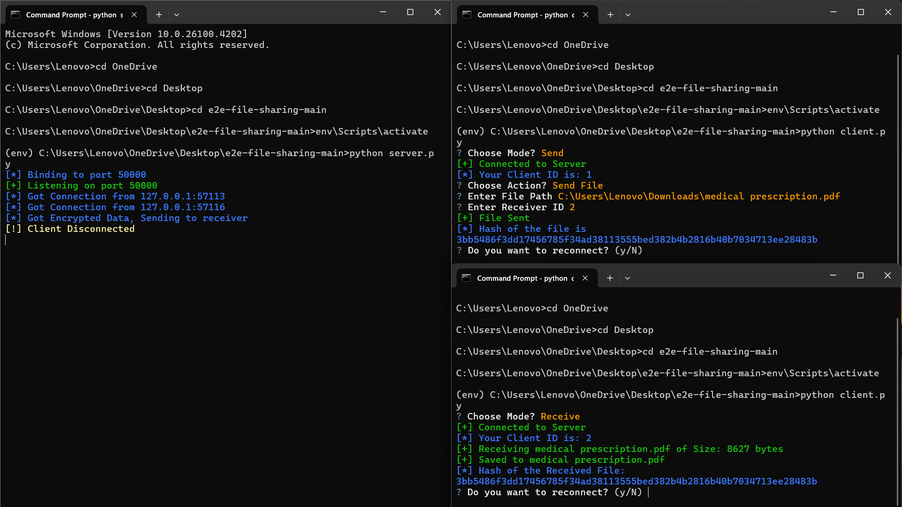
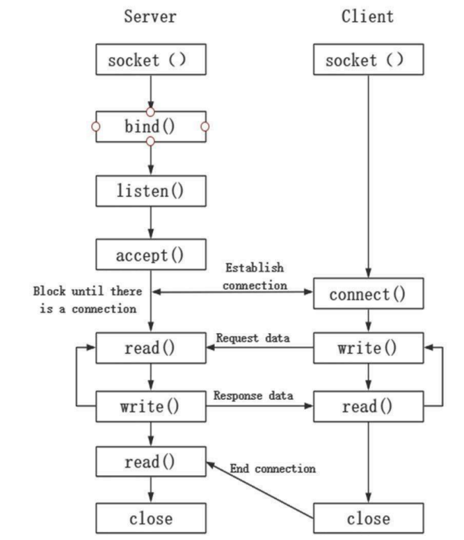

# End-to-End File Sharing System

A secure, encrypted file sharing system built with Python that provides end-to-end encryption for safe data transmission between clients through a central server.

## 🚀 Features

- **End-to-End Encryption**: Files are encrypted using AES encryption before transmission
- **Multi-Client Support**: Multiple clients can connect simultaneously to the server
- **Real-time File Transfer**: Live progress tracking during file uploads and downloads
- **Secure Communication**: All data transmission is protected with advanced cryptographic techniques
- **User-Friendly Interface**: Interactive command-line interface with colored output
- **Cross-Platform**: Compatible with Windows, Linux, and macOS

## 🛡️ Security Features

- **AES Encryption**: Advanced Encryption Standard with EAX mode
- **Cryptographically Secure Random Keys**: Uses `Crypto.Random` for key generation
- **File Integrity**: SHA-256 hash verification for transmitted files
- **Secure Key Management**: Keys and nonces are stored securely on the client system

## 🏗️ Architecture

The system follows a client-server architecture:

1. **Server**: Central hub that facilitates file transfers between clients
2. **Clients**: Can operate in two modes:
   - **Send Mode**: Upload and send files to other clients
   - **Receive Mode**: Receive files from other clients

### AES Encryption Process

1. Derive the set of round keys from the cipher key
2. Initialize the state array with the block data (plaintext)
3. Add the initial round key to the starting state array
4. Perform nine rounds of state manipulation
5. Perform the tenth and final round of state manipulation
6. Copy the final state array out as the encrypted data (ciphertext)

## 📋 Prerequisites

- Python 3.6 or higher
- Network connectivity
- Required Python packages (see Installation section)

## 🔧 Installation

1. Clone the repository:
```bash
git clone https://github.com/yourusername/end-to-end-file-sharing.git
cd end-to-end-file-sharing
```

2. Install required dependencies:
```bash
pip install pycryptodome questionary rich colorama
```

## 📦 Dependencies

- `socket` - Low-level networking interfaces
- `threading` - Multi-threading support for concurrent connections
- `signal` - Signal handling for graceful shutdown
- `pycryptodome` - Cryptographic operations (AES encryption)
- `questionary` - Interactive command-line prompts
- `rich` - Rich text and progress bars
- `colorama` - Colored terminal output
- `hashlib` - File integrity verification
- `os` - Operating system interface

## 🚀 Usage

### Starting the Server

Run the server script to start accepting client connections:

```bash
python server.py
```

The server will:
- Generate encryption keys and nonces
- Bind to localhost on port 50000
- Listen for incoming client connections
- Assign unique client IDs to connected clients

### Connecting Clients

Run the client script to connect to the server:

```bash
python client.py
```

### Client Modes

**Send Mode:**
1. Choose "Send" when prompted for mode selection
2. Select "Send File" from the action menu
3. Enter the file path you want to send
4. Enter the receiver's client ID
5. Monitor the upload progress

**Receive Mode:**
1. Choose "Receive" when prompted for mode selection
2. Wait for incoming file transfers
3. Files will be automatically saved to the current directory
4. Monitor the download progress

## 📁 Project Structure

```
end-to-end-file-sharing/
├── server.py          # Server implementation
├── client.py          # Client implementation
├── utils.py           # Utility functions (key generation, printing)
├── README.md          # Project documentation
└── requirements.txt   # Python dependencies
```

## 🔐 How It Works

1. **Server Setup**: The server generates encryption keys and starts listening for connections
2. **Client Connection**: Clients connect to the server and receive unique IDs
3. **File Selection**: Sender selects a file and specifies the receiver's ID
4. **Encryption**: File data is encrypted using AES encryption on the sender's side
5. **Transmission**: Encrypted data is sent through the server to the specified receiver
6. **Decryption**: Receiver decrypts the data and saves the original file
7. **Verification**: SHA-256 hash is computed to verify file integrity

## 🎯 Use Cases

- Secure document sharing in corporate environments
- Encrypted file transfer between team members
- Confidential data transmission
- Educational projects on network security
- Research collaboration with sensitive data

## 🛠️ Configuration

The system uses the following default configuration:
- **Host**: 127.0.0.1 (localhost)
- **Port**: 50000
- **Encryption**: AES with EAX mode
- **Buffer Size**: 1024 bytes
- **Max Connections**: 10

Keys and nonces are automatically generated and stored in:
- Windows: `%USERPROFILE%\.e2e_key` and `%USERPROFILE%\.e2e_nonce`
- Linux/Mac: `$HOME/.e2e_key` and `$HOME/.e2e_nonce`

## 🔒 Security Considerations

- Keys are generated using cryptographically secure random number generators
- AES encryption ensures data confidentiality during transmission
- SHA-256 hashing provides file integrity verification
- Network traffic is encrypted end-to-end
- Server acts only as a relay and cannot decrypt file contents

## 🤝 Contributing

1. Fork the repository
2. Create a feature branch (`git checkout -b feature/AmazingFeature`)
3. Commit your changes (`git commit -m 'Add some AmazingFeature'`)
4. Push to the branch (`git push origin feature/AmazingFeature`)
5. Open a Pull Request


## 📸 Screenshots

### Project Snapshot

*Real-time progress tracking during file transfer*

### System Architecture Diagram

*End-to-end file sharing system architecture*

## 📚 References

- [AES Block Cipher Overview](https://etutorials.org/Networking/802.11+security.+wi-fi+protected+access+and+802.11i/Appendixes/Appendix+A.+Overview+of+the+AES+Block+Cipher/Steps+in+the+AES+Encryption+Process/)
- [Python Socket Programming](https://www.digitalocean.com/community/tutorials/python-socket-programming-server-client)
- [Socket Model Flow Chart](https://www.researchgate.net/figure/Flow-chart-of-creating-a-socket-model_fig1_343811935)

---

**Note**: This project was developed as part of the Computer Networks and Internet of Things Lab coursework, focusing on implementing secure file sharing with modern cryptographic techniques.